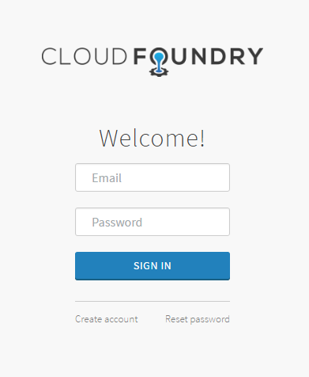

[<- home page](../README.md)
### Features

From this page you can briefly learn main features that Logsearch-for-cloudfoundry adds to Logsearch.

#### Logs retrieval from CloudFoundry

CloudFoundry can be configured to send its _platform logs_ (logs of CloudFoundry components) via _relp_. Logsearch has jobs for accepting logs sent via relp and sending them to _syslog_. Therefore these CloudFoundry logs get in Logsearch with no additional efforts.

For application logs CloudFoundry has [_firehose_](https://github.com/cloudfoundry/firehose-plugin) feature. To get application logs from CloudFoundry using firehose Logsearch-for-cloudfoundry adds a job that runs [_firehose-to-syslog_](https://github.com/cloudfoundry-community/firehose-to-syslog/) utility. This utility written in _golang_ retrieves logs from firehose and sends them to syslog.

So, as the result, CloudFoundry logs (both platform and application) appear in syslog and get processed by Logsearch.

#### Logstash parsing rules

Logsearch has a set of parsing rules for syslog formats. And it's a good start in general case.

Additionally to this, Logsearch-for-cloudfoundry provides a set of parsing rules for CloudFoundry logs using log formats of CloudFoundry components, firehose-to-syslog (for application logs) and general formats such as _JSON_.

For more details on parsing please visit [Logs parsing](logs-parsing.md) page.

#### Elasticsearch mappings

Logsearch-for-cloudfoundry provides Elasticsearch [mappings](../src/logsearch-config/src/es-mappings) for logs index. The mappings include reasonable rules for making the parsed fields useful in data analysis. They include:

* Make `*_id` fields *not_analyzed*. 

  There is no need to analyze ID fields because of their nature - they are indicators, not a full text. Additionally, Kibana *authentication plugin* __relies on this mapping__, because it uses fields `@cf.org_id` and `@cf.space_id` for data filtering (read below).

* Add `*.raw` fields as *not_analyzed* copies of some string fields. 

  By using this mapping a string field is indexed as an analyzed field for full-text search, and as a not_analyzed field for sorting and aggregations in data analysis. We apply this mapping to all known string fields that we parse and whant to use not only for full-text search, but also for data analysis.

* Make `geopoint` field of *geo_point* datatype.

  This mapping allows to build *tile map* visualizations on this field.

#### Kibana authentication plugin

Logsearch-for-cloudfoundry extends Kibana with [authentication plugin](../src/kibana-cf_authentication). The plugin uses [_UAA_](https://github.com/cloudfoundry/uaa) (user authentication and authorization server for CloudFoundry) to authenticate a user and get the account information including organizations and spaces in CloudFoundry platform this user has rights to. 

Based on the account information the user is authorized in Kibana to see *logs of applications running in those organizations and spaces only*. Admin users are authorized to see *all data in Kibana including CloudFoundry platform logs* (admin users are users from system organization - the organisation that owns the CloudFoundry system domain).

From technical point of view, the authorization mechanism applies additional filters to all search requests made from Kibana to Elasticsearch to limit data shown to user. The filtering is done by `@cf.org_id` and `@cf.space_id` fields. To make filtering by these fields possible we specify them as *not_analyzed* in **Elasticsearch mappings** (read [Elasticsearch mappings](#elasticsearch-mappings) section above).

The plugin is delivered in Logsearch-for-cloudfoundry deployment with _cf-kibana_ job (case of Kibana deployed to CloudFoundry) and as a plugin installed to standalone Kibana provided by Logsearch deployment.

#### Kibana saved objects

Kibana allows to save searches, visualizations, and dashboards and then reuse them when searching data. 

To make some start in logs analysis, Logsearch-for-cloudfoundry creates index patterns and a set of predefined searches, visualizations and dashboards in Kibana. These [saved objects](../src/logsearch-config/src/kibana-objects) are uploaded to Elasticsearch (.kibana index) during deploy.

The upload of Kibana objects is optional step and can be ommited. Also, any of uploaded Kibana objects can be deleted then using Kibana interface.

#### Possibility to deploy Kibana as CloudFoundry application

Logsearch-for-cloudfoundry provides a possibility to deploy Kibana to a CloudFoundry platform. So that instead of a standalone instance (this option is provided by Logsearch deployment) you get your Kibana running in CloudFoundry.

The pros of this approach (comparing to using of a standalone Kibana instance):

* Easier deployment
* Automatic scalability and load balancing provided by CloudFoundry platform
* Less resources is needed

When deploying you can choose which approach to use. See [Deployment](deployment.md) section for deploy instructions for each option.

---
For details on the features delivery in Logsearch-for-cloudfoundry deployment see [Jobs](jobs.md) page. For customization options visit [Customization](customization.md) page.

 [<- prev page](intro.md) | [next page ->](jobs.md)
